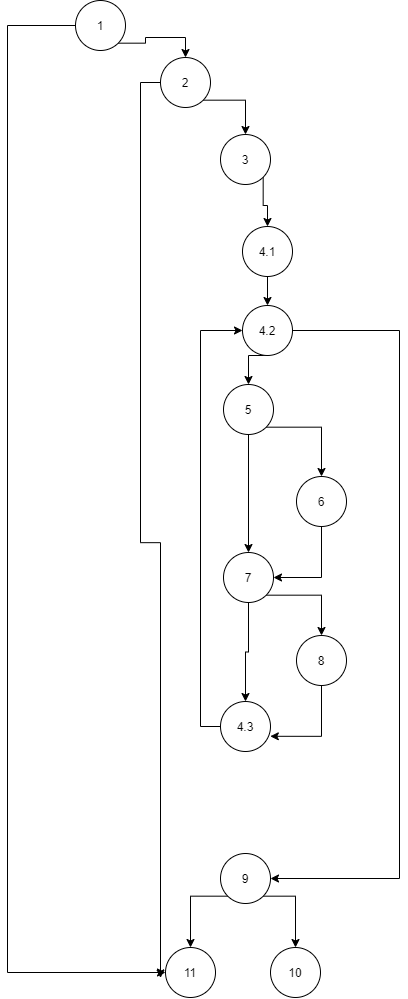

# SI_lab2_186005
# **Втора лабораториска вежба по Софтверско инженерство**

## Никола Каневче, бр. на индекс 186005

### Група на код:

Ја добив групата на код 1

Control Flow Graph

### Цикломатска комплексност

Цикломатската комплексност на овој код е 7, истата ја добив преку формулата P+1, каде што P е бројот на предикатни јазли. Во случајoв P=6, па цикломатската комплексност изнесува 7.

### Тест случаи според критериумот Multiple condition

При користење на наведениот критериум, потребно е да се изминат сите предикатни јазли, и да се поминат сите исходи од сите предикатни јазли (true или false).

За првиот предикатен јазелсо повеќе изрази

(2: if (user.getUsername()!=null &amp;&amp; user.getEmail()!=null &amp;&amp; !allUsers.contains(user.getUsername())))

 user.getUsername() == Nikola &amp;&amp;
 user.getEmail() == nikolakanevce@gmail.com &amp;&amp;
 !allUsers.contains(&quot;Nikola&quot;) == True; 
 
 user.getUsername() == null; 
 user.getUsername() == Nikola &amp;&amp;
 user.getEmail() == null; 
 
 user.getUsername() == Nikola &amp;&amp;
 user.getEmail() == nikolakanevce@gmail.com &amp;&amp;
 !allUsers.contains(&quot;Nikola&quot;) == False; 

За вториот предикатен јазелсо повеќе изрази

(7: if (atChar &amp;&amp; user.getEmail().charAt(i)==&#39;.&#39;))

user.getUsername() == Nikola &amp;&amp;
 user.getEmail() == nikolakanevce@gmail.com &amp;&amp;
 !allUsers.contains(&quot;Nikola&quot;) == True; 
user.getUsername() == Nikola &amp;&amp;
 user.getEmail() == nikolakanevce@gmailcom &amp;&amp;
 !allUsers.contains(&quot;Nikola&quot;) == True;
 user.getUsername() == Nikola &amp;&amp;
 user.getEmail() == nikolakanevce.gmail.com &amp;&amp;
 !allUsers.contains(&quot;Nikola&quot;) == True; 

За третиот предикатен јазелсо повеќе изрази

(9: if (atChar &amp;&amp; dotChar))

 user.getUsername() == Nikola &amp;&amp;
 user.getEmail() == nikolakanevce@hotmail.com &amp;&amp;
 !allUsers.contains(&quot;Nikola&quot;) == False;
 user.getUsername() == Nikola &amp;&amp;
 user.getEmail() == nikolakanevce@hotmailcom &amp;&amp;
 !allUsers.contains(&quot;Nikola&quot;) == True; 
 user.getUsername() == Nikola &amp;&amp;
 user.getEmail() == nikolakanevce.hotmail.com &amp;&amp;
 !allUsers.contains(&quot;Nikola&quot;) == True; 

### Тест случаи според критериумот Every path

При тестирање со критерумот Every path, мора да ги опфатиме сите можни патеки во FCG. Бројот на такви патеки е еднаков со цикломатската комплексност на графот, но бидејќи има случаи кога некои патеки се невозможни, крајниот број на патеки ќе биде помал.

Сите патеки:

1-11 - терминира

1-2-11 - терминира

1-2-3-4.1-4.2-9-11 - терминира

1-2-3-4.1-4.2-5-7-4.3-4.2 – продолжува со итерацијата на ист начин

1-2-3-4.1-4.2-5-6-7-4.3-4.2 – продолжува со итерацијата1-2-3-4.1-4.2-5-7-4.3-4.2

1-2-3-4.1-4.2-5-6-7-4.3-4.2 – некоја од следните итерации ќе биде:

1-2-3-4.1-4.2-5-7-8-4.3-4.2

\*1-2-3-4.1-4.2-9-10 - терминира

Редот обележан со \* , ќе го исфрлиме бидејќи поради самата природа на кодот, не е возможно да се генерира тест случај кој ќе поминува точно и исклучиво само по таа патека.

1. За првиот ред еден тест случај е кога user == null.
2. За вториот ред еден тест случај е кога во листата на сите корисници постои username на корисникот за кој проверуваме.
3. За третиот ред еден тест случај е
user.getUsername() == &quot;Nikola&quot;
 user.getPassword() == &quot;blablabla&quot;
 user.getEmail() == &quot;&quot;
4. За четвртиот ред можен тест случај е:
user.getUsername() == &quot;Nikola&quot;
 user.getPassword() == &quot;blablabla&quot;
 user.getEmail() == &quot;nikola&quot;
Поради тоа што во email немаме знак &#39;@&#39;, нема да се влезе во ниту еден if блок во for циклусот на кодот.
5. За петтиот ред можен тест случај е:
user.getUsername() == &quot;Nikola&quot;
 user.getPassword() == &quot;blablabla&quot;
 user.getEmail() == &quot;Nikola@&quot;
Поради тоа што во email немаме знак &#39;.&#39;, нема да се влезе во вториот if блок во for циклусот на кодот.
6. За шестиот ред можен тест случај е:
user.getUsername() == &quot;Nikola&quot;
 user.getPassword() == &quot;blablabla&quot;
 user.getEmail() == &quot;Nikola@hotmail.com&quot;
Со овој тест случај, ќе се влезе во двата if блока во циклусот.

### Објаснување на напишаните unit tests

**Every path:**

_Every path_ _е критериум со кој треба да ги поминеме сите патишта во графот, кои почнуваат од најгорниот јазој (1), и завршуваат во некој терминален јазол._

1. Со првиот тест случај ја проверуваме патеката 1-11, односно го проверуваме резултатот во случај кога првиот услов не е исполнет.
2. Со вториот тест случај ја проверуваме патеката 1-2-11, односно патеката низ која ќе одиме кога вториот услов нема да е исполнет.
3. Третиот тест случај е за патеката 1-2-3-4.1-4.2-9-11, која ја поминуваме тогаш кога нема да влеземе внатре во for циклусот, односно кога user.getEmail().length() == 0.
4. Четвртиот тест случај е за патеката 1-2-3-4.1-4.2-5-7-4.3-4.2, односно оваа патека ја поминуваме константно само кога во ниеден случај нема да е исполнет некој од условите во for циклусот.
5. Патеката 1-2-3-4.1-4.2-5-6-7-4.3-4.2 ја поминуваме со петтиот тест случај, така што во некоја од итерациите првиот услов во for циклусот ќе биде исполнет, а во секоја друга итерација ја поминуваме патеката 1-2-3-4.1-4.2-5-7-4.3-4.2.
6. Патеката 1-2-3-4.1-4.2-5-6-7-4.3-4.2 ја поминуваме со шестиот тест случај, така што во некоја од итерациите првиот услов во for циклусот ќе биде исполнет, а потоа во некоја следна итерација, исто така и вториот услов во for циклусот ќе биде исполнет и ја минуваме патеката 1-2-3-4.1-4.2-5-7-8-4.3-4.2

**Multiple condition**

_Multiple condition_ _е критериум со кој ги проверуваме сите можни исходи на предикатните јазли кои содржат повеќе услови._

if (user.getUsername()!=null &amp;&amp; user.getEmail()!=null &amp;&amp; !allUsers.contains(user.getUsername())))

1. Првиот тест случај е кога сите искази во овој предикатен јазел се точни, па така и целиот услов ќе биде точен.
2. Вториот тест случај е кога првиот исказ во овој јазел е неточен, па така, другите не се проверуваат, и целиот услов враќа вредност False.
3. Третиот тест случај е кога првиот е точен, но вториот исказ е грешен. Целиот услов враќа False.
4. Четвртиот тест пример е кога првите два искази се точни, но третиот е грешен, па затоа и целиот услов ќе биде грешен.

if (atChar &amp;&amp; user.getEmail().charAt(i)==&#39;.&#39;)

1. Петтиот тест случај е кога двата искази во овој услов се точни, па така и целиот услов ќе биде точен.
2. Шестиот тест случај е кога првиот исказ е точен, но вториот е грешен. Целиот услов ќе биде грешен.
3. Седмиот тест случај е кога првиот исказ е грешен, па така и условот ќе врати False.

if (atChar &amp;&amp; dotChar)

1. Осмиот тест случај е кога двата искази во овој услов се точни, па така и целиот услов ќе биде точен.
2. Деветтиот тест случај е кога првиот исказ е точен, но вториот е грешен. Целиот услов ќе биде грешен.
3. Десеттиот тест случај е кога првиот исказ е грешен, па така и условот ќе врати False.
